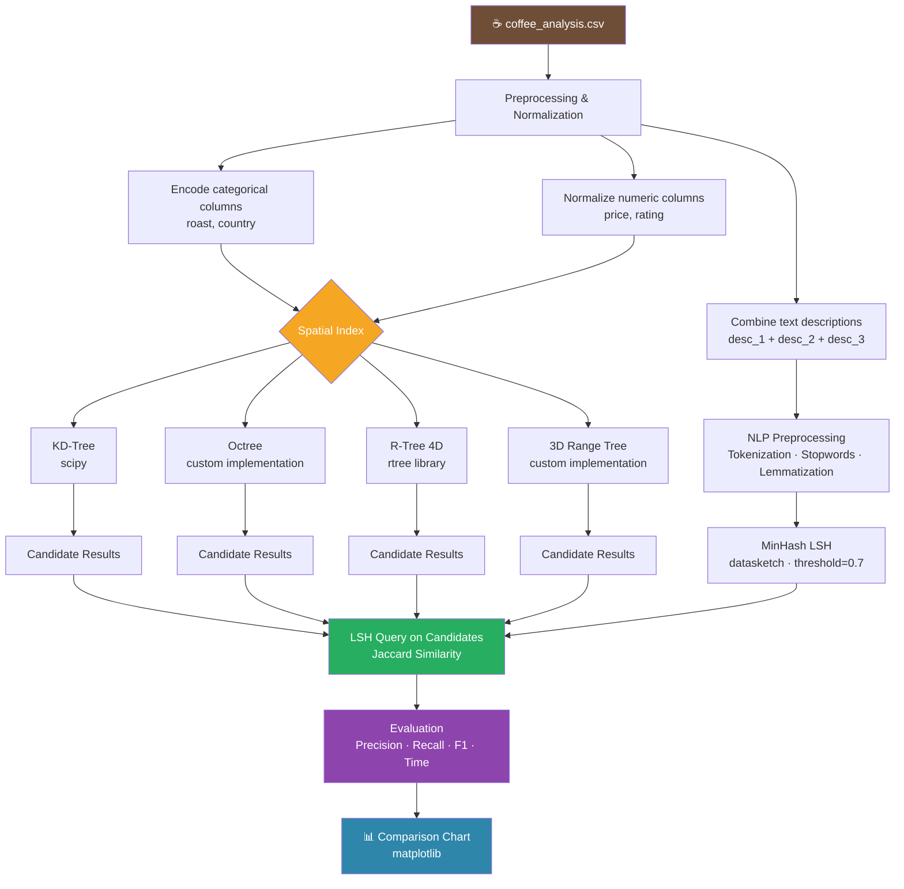

# ☕ Coffee Recommendation System — Spatial Indexing & LSH

Python project implementing a multi-index similarity search system for coffee recommendations, combining **spatial data structures** with **text similarity** techniques, developed collaboratively.

---

## 📌 About

This project builds a coffee recommendation engine on a real-world coffee dataset (`coffee_analysis.csv`). It explores and compares four different spatial indexing structures combined with **Locality-Sensitive Hashing (LSH)** for text similarity, evaluating their performance in terms of precision, recall, F1 score, and query time.

---

## 🏗️ Pipeline

---

## 🛠️ Tech Stack

| | |
|---|---|
| Language | Python 3 |
| Data | pandas, numpy |
| Spatial Indexing | scipy (KD-Tree), rtree (R-Tree) |
| Text Similarity | datasketch (MinHash LSH), scikit-learn (TF-IDF) |
| NLP | nltk (stopwords, lemmatization) |
| Visualization | matplotlib |

---

## 🔍 Spatial Structures Implemented

### 1. KD-Tree
- Built on normalized numeric features: price, rating, country, roast
- Range query to find coffees within a radius of a target point

### 2. Octree (custom implementation)
- 3D spatial partitioning built from scratch
- Recursive subdivision with point insertion and range queries

### 3. R-Tree (4D)
- 4-dimensional index using the `rtree` library
- Supports efficient range queries across all 4 features simultaneously

### 4. 3D Range Tree (custom implementation)
- Recursive tree built from scratch for 3D range queries
- Dimension-by-dimension filtering with associated sub-trees

---

## 📊 Evaluation

Each spatial index filters candidate coffees, then **LSH + MinHash** is applied on the text descriptions to find similar items based on Jaccard similarity (threshold = 0.7).

Results are compared across:

| Metric | Description |
|--------|-------------|
| Precision | Relevant results among retrieved |
| Recall | Retrieved relevant results out of all relevant |
| F1 Score | Harmonic mean of Precision & Recall |
| Query Time | Time for LSH queries on each index's candidates |

---

## 📁 Files

| File | Description |
|------|-------------|
| `Code.txt` / `Code.py` | Main implementation |
| `Report.docx` | Full project report with analysis and results |
| `coffee_analysis.csv` | Dataset (not included — too large) |

---

## 🎓 What I Learned

- Implementing spatial data structures from scratch (Octree, Range Tree)
- Using KD-Tree and R-Tree for multi-dimensional range queries
- Applying MinHash LSH for approximate text similarity at scale
- NLP preprocessing: tokenization, stopword removal, lemmatization, TF-IDF
- Evaluating information retrieval systems with Precision, Recall & F1
  
---
## 📄 License

This project was created for academic purposes.
